<div align="center">

# 🚀 Portfolio Admin Ecosystem
*Fast, bilingual Next.js portfolio with a secure, MFA-protected admin dashboard*

<br />


<br />

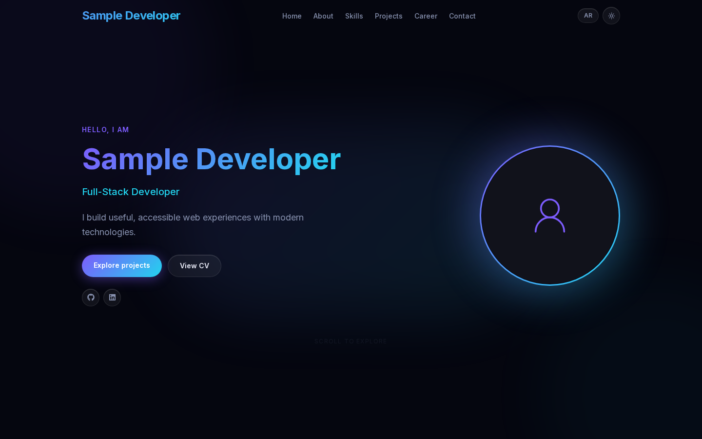

</div>

<br />

## ✨ Features

- **Bilingual** English / Arabic with full RTL layout and a dark / light theme
- **Admin dashboard** (`/admin`) to edit every section, upload images and CVs, and import projects from GitHub, with no redeploy needed
- **Secure by default**: Supabase Auth with MFA, an email allow-list, and database Row Level Security
- **Contact form** delivered by [Resend](https://resend.com) from a server-side route
- **Fast**: statically rendered and cached at the edge, refreshed on every admin save; optimized images and self-hosted fonts
- **Responsive** from 320px phones to wide desktops

> 📘 **Setting it up?** Follow the **[Implementation Plan](docs/IMPLEMENTATION_PLAN.md)**, a step-by-step Supabase → Resend → Vercel guide with direct links to every settings page.

---

## 📸 Screenshots

The screenshots use the built-in fictional sample content.

### Desktop

| Dark | Light |
|:---:|:---:|
|  | 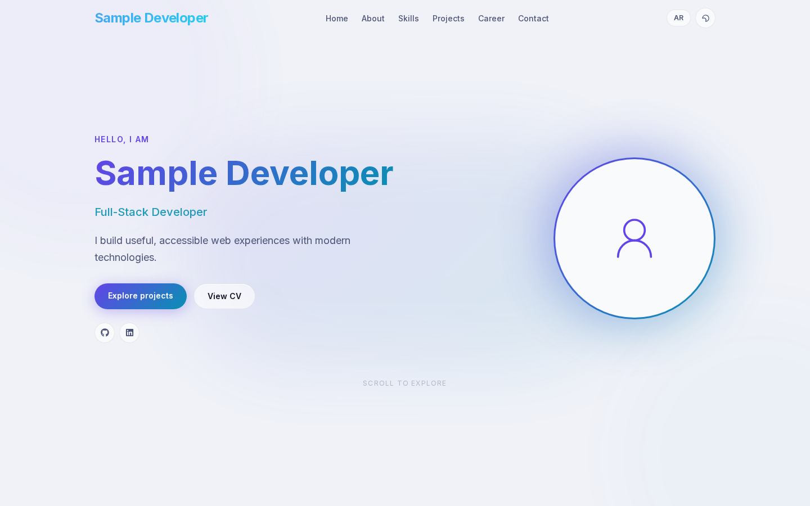 |


### Arabic (RTL) and admin sign-in

| Arabic / RTL | Admin sign-in |
|:---:|:---:|
| 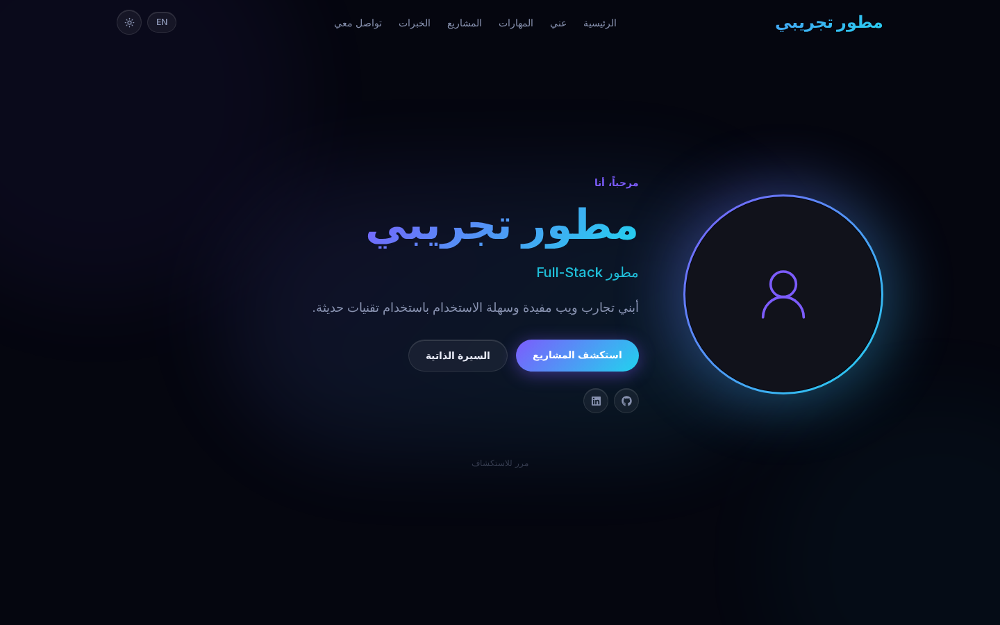 | 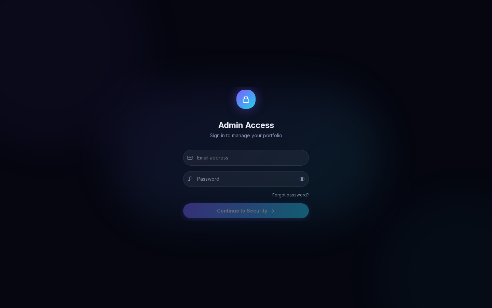 |

### Admin dashboard

All dashboard screenshots use mock data and a mock `admin@example.com` account.

| Overview | Hero editor |
|:---:|:---:|
| 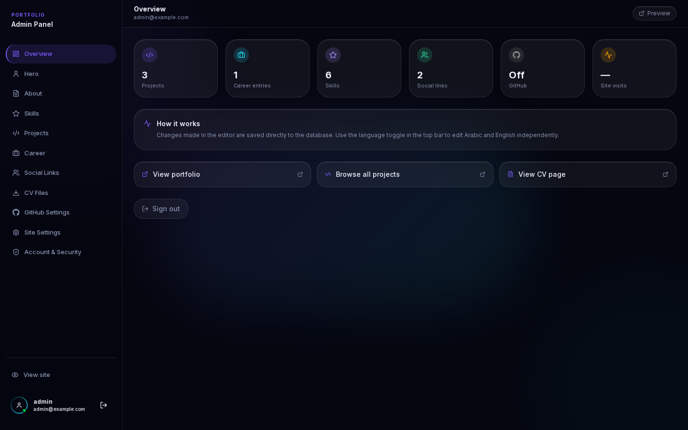 | 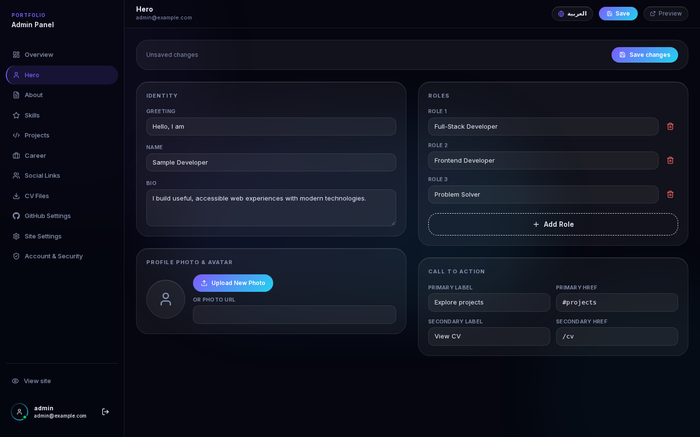 |

| Projects (EN + AR side by side) | Skills |
|:---:|:---:|
| 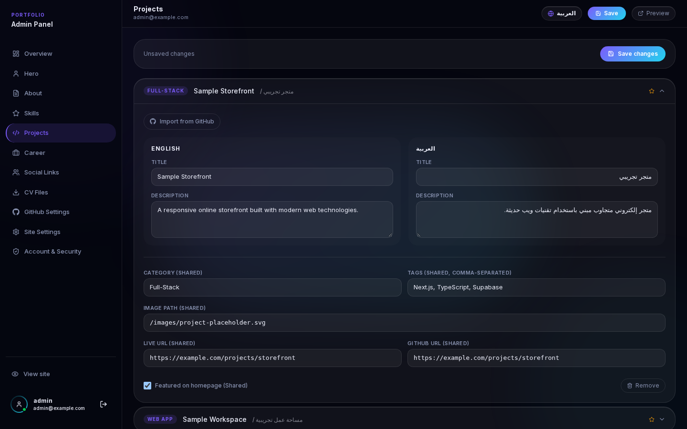 | 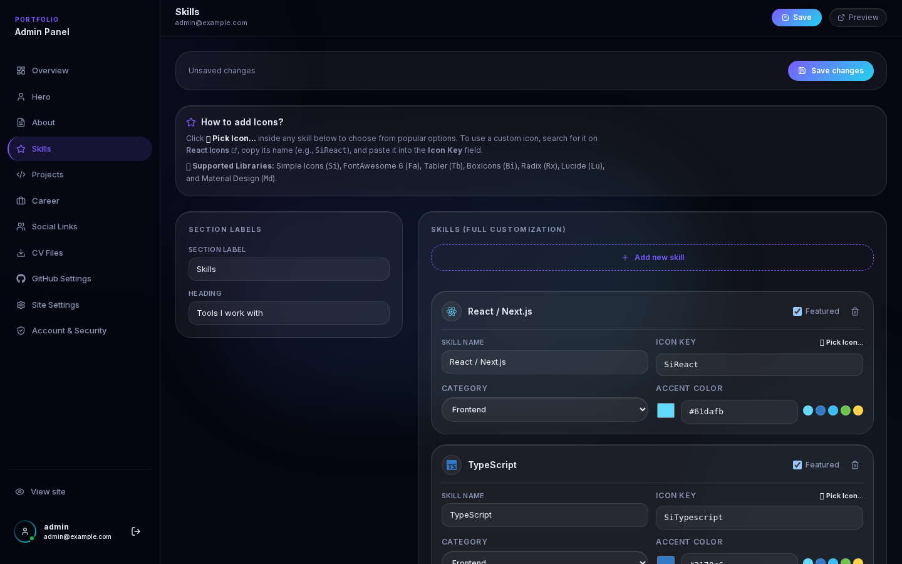 |

| Social links | GitHub import |
|:---:|:---:|
| 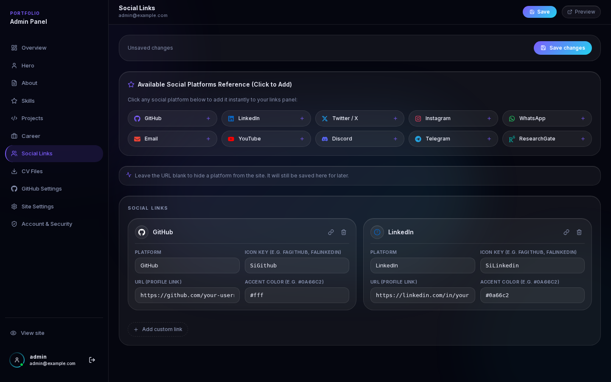 | 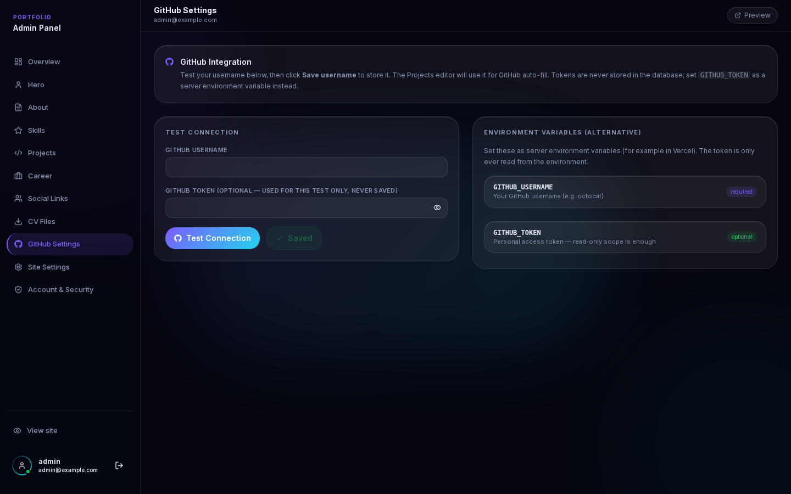 |

| Site settings | Account and 2FA |
|:---:|:---:|
| 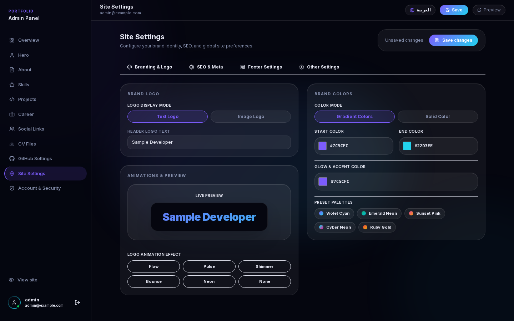 | 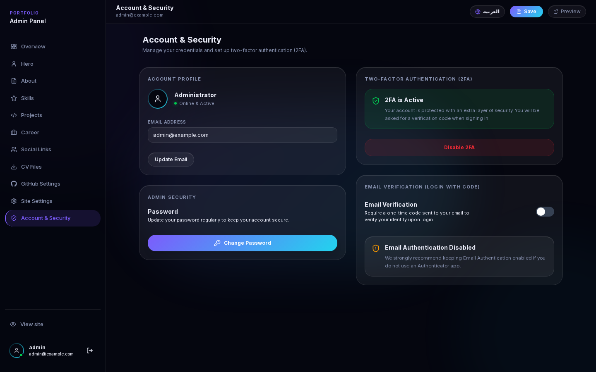 |

<div align="center">
  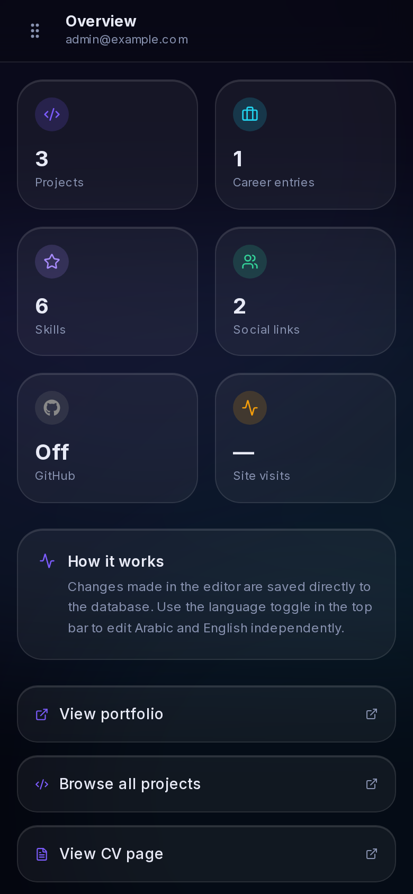
</div>

<details>
<summary><b>Full-page views</b></summary>

<br />

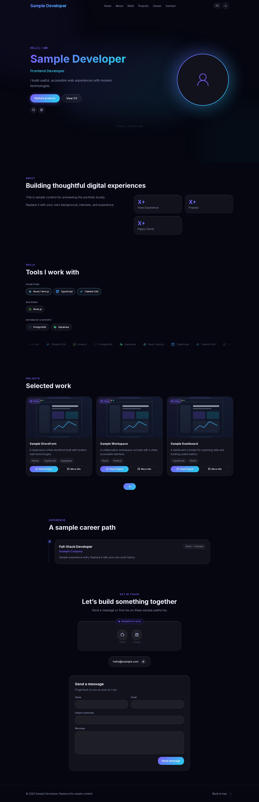

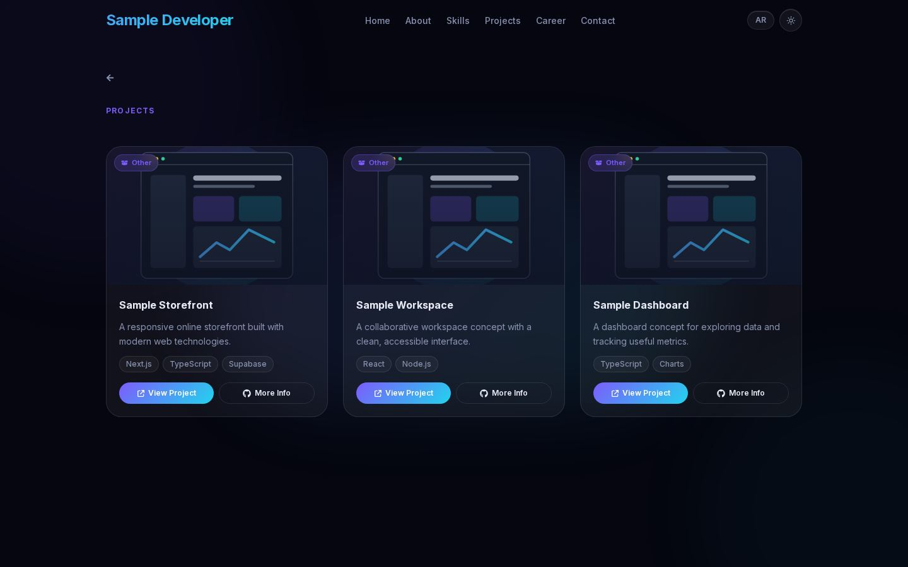

</details>

---

## 🏗️ Architecture

Public pages are rendered statically and served from the edge cache. Content is read with Supabase's public key under Row Level Security; only allow-listed admins can write. Saving in the admin clears the cache so changes go live immediately.

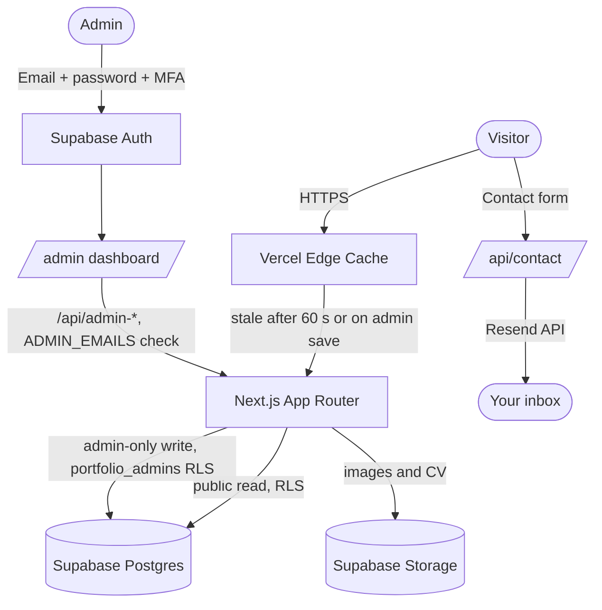

---

## 🚀 Quick start

```bash
npm install
npm run dev          # http://localhost:3000
```

With no environment variables, development mode shows built-in **sample content** so you can explore the UI right away. The admin area always requires Supabase.

For the real thing, copy `.env.exmp` to `.env.local` and fill it in:

```env
SUPABASE_URL=https://your-project-id.supabase.co
SUPABASE_PUBLISHABLE_KEY=sb_publishable_...
ADMIN_EMAILS=you@yourdomain.com

RESEND_API_KEY=re_...
CONTACT_EMAIL=you@yourdomain.com
RESEND_FROM_EMAIL=Portfolio <contact@yourdomain.com>

# Optional, server-side only
GITHUB_USERNAME=
GITHUB_TOKEN=
```

Quick links (full details in the [Implementation Plan](docs/IMPLEMENTATION_PLAN.md)):

| Service | Open |
|---------|------|
| Supabase | [New project](https://supabase.com/dashboard/new) · [SQL editor](https://supabase.com/dashboard/project/_/sql/new) · [Users](https://supabase.com/dashboard/project/_/auth/users) · [API keys](https://supabase.com/dashboard/project/_/settings/api-keys) · [URL configuration](https://supabase.com/dashboard/project/_/auth/url-configuration) |
| Resend | [Sign up](https://resend.com/signup) · [Domains](https://resend.com/domains) · [API keys](https://resend.com/api-keys) · [Email logs](https://resend.com/emails) |
| Vercel | [New project](https://vercel.com/new) · [Env variables docs](https://vercel.com/docs/environment-variables) · [Domains docs](https://vercel.com/docs/domains) |

### Database in one minute
1. Run [`supabase/seed.sql`](supabase/seed.sql) in the Supabase SQL editor (tables, policies, storage bucket, sample content).
2. Allow-list your admin email for writes:
   ```sql
   INSERT INTO public.portfolio_admins (email)
   VALUES (lower('you@yourdomain.com')) ON CONFLICT (email) DO NOTHING;
   ```
3. Existing project? Run only [`supabase/security-hardening.sql`](supabase/security-hardening.sql) to replace broad write policies.

> `seed.sql` drops and recreates the portfolio tables. Use it on a fresh project.

---

## 🔐 Security

- Admin pages and every `/api/admin-*` route require a signed-in Supabase user whose email is in `ADMIN_EMAILS`
- Database and Storage writes are enforced again in Postgres via `portfolio_admins` and Row Level Security
- Only the **publishable** key is used. No service-role key is needed or read
- Secrets (`RESEND_API_KEY`, `GITHUB_TOKEN`) are server-only and are never stored in the database
- Uploads are validated by type and size and run under the admin's own session
- Contact form: origin check, validation, honeypot, escaped HTML
- Security headers (`nosniff`, frame denial, referrer and permissions policy) are set in `next.config.mjs`

Found a vulnerability? Please open a private security advisory on GitHub instead of a public issue.

---

## 📂 Project structure

```text
app/
 ├── admin/          # Admin dashboard, login, password reset
 ├── api/            # admin-* routes (protected), contact, github-repos
 ├── auth/callback/  # Supabase auth redirect handler
 ├── cv/ projects/   # Public pages
 └── page.tsx        # Home
components/          # Hero, About, Skills, Projects, Career, Social, Navbar...
context/ hooks/      # Content, language and theme providers
lib/                 # Content loading/saving, admin auth, sample content
supabase/            # schema.sql, seed.sql, security-hardening.sql
docs/                # IMPLEMENTATION_PLAN.md and screenshots
proxy.ts             # Guards /admin (session refresh + allow-list)
```

---

## 🌐 Deploying

Short version: push to GitHub → [import in Vercel](https://vercel.com/new) → add the environment variables above → deploy → add your Vercel/custom domain to Supabase **Authentication → URL Configuration**. The full walkthrough is in the **[Implementation Plan](docs/IMPLEMENTATION_PLAN.md)**.

---

## 🙏 Credits

The admin dashboard is **not original work by this repository's author**. It started from the project built in the video
[“I Vibe-Coded My Portfolio Website in 35 Minutes (With a Custom Domain) and Gitlab CICD”](https://youtu.be/Lz-nYRsCqKk),
by **[Soumil Shah](https://github.com/soumilshah1995)** ([YouTube](https://www.youtube.com/@SoumilShah)), and was then enhanced here with new features (Supabase Auth with MFA and an admin allow-list, bilingual EN/AR editing,
Resend contact form, GitHub project import, caching and performance work, and security hardening).
Credit for the original idea and base belongs to its creator; any rights in that original material stay with them.

## 📄 License

The enhancements and new code in this repository are released under the **[MIT License](LICENSE)**: free for anyone
to use, copy, modify, customize, publish, distribute and **sell**, with no fees or permission needed. The only condition is
keeping the license notice in copies of the code. It is provided "as is", without warranty.

<div align="center">
  <p><i>Engineered with precision. Maintained with care.</i></p>
</div>
